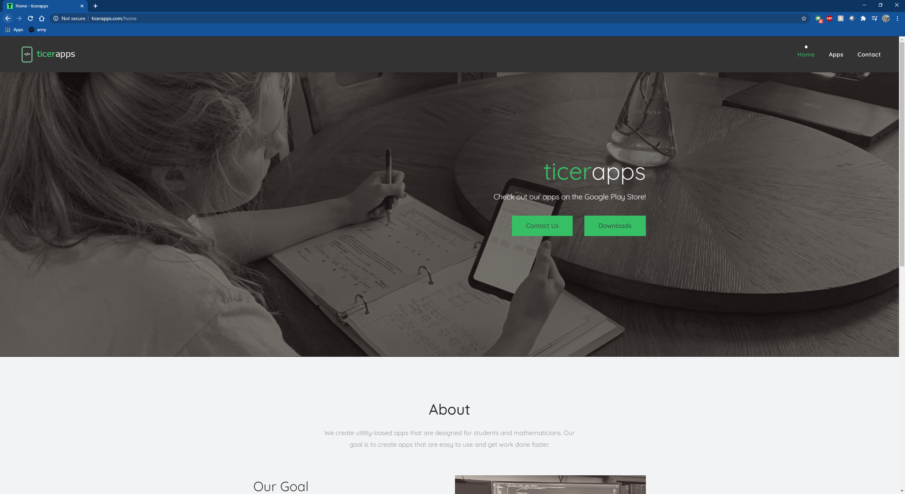

# ticerapps-website
A website for my mobile apps that I created as my final project in a web-dev course. This was my first exposure to the Bootstrap framework, JQuery, Ajax, and PHP. 

Check it out: http://ticerapps.com/
